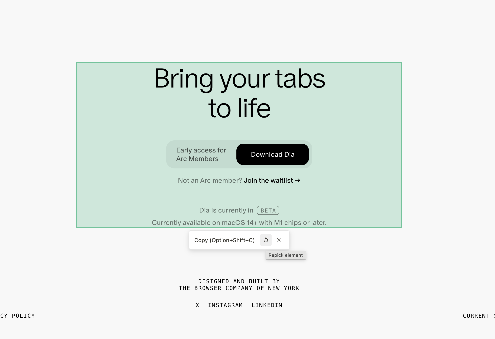

# Copy as Markdown - Chrome 扩展

<div align="center">


**精准选取网页元素，快速转换为 Markdown 格式的专业工具**

[](https://chrome.google.com/webstore)
[](https://github.com/hifizz/copy-as-markdown)
[](LICENSE)

[官方网站](https://cam.zilin.im) | [GitHub 仓库](https://github.com/hifizz/copy-as-markdown)

[English](#english) | [中文文档](#中文文档)


</div>

## 中文文档

### 🚀 核心功能

Copy as Markdown 专注于精准的局部内容复制，提供四大核心功能：

#### 🎯 选取元素复制

- **功能描述**: 按住 Alt 键点击任意元素即可精确复制内容
- **快捷键**: `Alt + Shift + E`
- **使用场景**: 精准复制表格、代码块、段落等结构化元素
- **特色**: 智能元素识别，避免复制无关内容

#### ✂️ 划选文本复制

- **功能描述**: 划选任意文本内容快速转换为 Markdown 格式
- **快捷键**: `Alt + Shift + C`
- **使用场景**: 快速复制文章段落、标题等文本内容
- **特色**: 保持原有格式，智能转换链接和样式

#### 🖱️ 右键菜单 & 快捷键

- **功能描述**: 右键菜单快速访问，丰富的快捷键支持
- **支持操作**: 复制选中内容、复制页面元素
- **自定义**: 可在 Chrome 扩展设置中自定义快捷键
- **便捷性**: 多种操作方式，适应不同使用习惯

#### 📑 标签页信息管理

- **功能描述**: 通过 Popup 面板管理和复制当前标签页信息
- **支持格式**:
  - Markdown 链接格式: `[页面标题](URL)`
  - 纯标题文本
  - 纯 URL 链接
  - 批量复制所有标签页

### 🎨 主题与定制

#### 选择元素配色方案

- **经典绿色**: 传统的绿色选择高亮
- **优雅绿色**: 现代化翠绿色，更柔和
- **专业蓝色**: 与工具栏主题一致
- **温和橙色**: 高可见性，不刺眼
- **现代紫色**: 富有创新感
- **中性灰色**: 最低调优雅

#### 工具栏主题

- **经典白色**: 纯白背景，深灰文字
- **经典深色**: 深灰背景，白色文字

### 🌍 多语言支持

- 🇨🇳 简体中文
- 🇺🇸 English
- 🔄 自动检测系统语言

### 📦 安装方式

#### 通过 Chrome Web Store（推荐）

1. 访问 [Chrome Web Store 「待发布到商店」](#)
2. 点击"添加至 Chrome"
3. 确认安装权限

#### 开发者模式安装

1. 从 [GitHub](https://github.com/hifizz/copy-as-markdown) 下载最新版本的 `.zip` 文件
2. 解压到本地文件夹
3. 打开 Chrome 扩展管理页面 (`chrome://extensions/`)
4. 开启"开发者模式"
5. 点击"加载已解压的扩展程序"，选择解压后的文件夹

### 🔧 使用说明

#### 基本使用

1. **安装扩展后**，访问任意网页
2. **选取元素**: 按住 `Alt` 键并点击页面元素，智能选择目标区域
3. **选择文本**: 划选文本后使用快捷键 `Alt + Shift + C`
4. **右键菜单**: 右键点击页面内容，选择相应的复制选项
5. **标签页管理**: 点击扩展图标，使用 Popup 面板管理标签页

#### 高级功能

- **智能元素识别**: 自动识别最合适的复制范围
- **批量操作**: 在 Popup 面板中批量复制所有标签页信息
- **格式定制**: 在设置中选择不同的主题和配色方案
- **快捷键定制**: 在 Chrome 扩展设置中自定义快捷键

### 🛠️ 技术栈

- **框架**: [WXT](https://wxt.dev/) - 现代 Web 扩展开发框架
- **前端**: React 19 + TypeScript
- **Markdown 转换**: Turndown + turndown-plugin-gfm
- **构建工具**: Vite
- **测试**: Vitest
- **UI 组件**: 自定义 React 组件

### 🔒 权限说明

扩展需要以下权限来正常工作：

- **contextMenus**: 添加右键菜单选项
- **tabs**: 读取标签页信息（标题、URL）
- **storage**: 保存用户偏好设置（主题、语言等）
- **scripting**: 在网页中注入内容脚本

### 🚦 兼容性

- **Chrome**: 88+
- **Edge**: 88+
- **其他 Chromium 内核浏览器**: 理论支持

### 📝 开发与贡献

#### 本地开发

```bash
# 安装依赖
pnpm install

# 开发模式（Chrome）
pnpm dev

# 开发模式（Firefox）
pnpm dev:firefox

# 构建生产版本
pnpm build

# 打包扩展
pnpm zip
```

#### 测试

```bash
# 运行测试
pnpm test

# 运行测试（UI 模式）
pnpm test:ui

# 生成覆盖率报告
pnpm test:coverage
```

#### 贡献指南

1. Fork [本仓库](https://github.com/hifizz/copy-as-markdown)
2. 创建功能分支 (`git checkout -b feature/amazing-feature`)
3. 提交更改 (`git commit -m 'feat: add amazing feature'`)
4. 推送分支 (`git push origin feature/amazing-feature`)
5. 创建 Pull Request

### 📄 许可证

本项目基于 MIT 许可证开源 - 查看 [LICENSE](LICENSE) 文件了解详情。

### 🙏 致谢

- [WXT](https://wxt.dev/) - 优秀的 Web 扩展开发框架
- [Turndown](https://github.com/mixmark-io/turndown) - HTML 到 Markdown 转换库
- [React](https://react.dev/) - 用户界面构建库

---

## English

### 🚀 Core Features

Copy as Markdown focuses on precise local content copying with four core features:

#### 🎯 Element Picker

- **Description**: Hold Alt key and click any element to precisely copy content
- **Shortcut**: `Alt + Shift + E`
- **Use Cases**: Precisely copy tables, code blocks, paragraphs and other structured elements
- **Features**: Smart element recognition, avoid copying irrelevant content

#### ✂️ Text Selection Copy

- **Description**: Select any text content and quickly convert to Markdown format
- **Shortcut**: `Alt + Shift + C`
- **Use Cases**: Quickly copy article paragraphs, headings and other text content
- **Features**: Preserve original formatting, smart conversion of links and styles

#### 🖱️ Context Menu & Shortcuts

- **Description**: Quick access via right-click menu with rich shortcut support
- **Supported Actions**: Copy selected content, copy page elements
- **Customization**: Customize shortcuts in Chrome extension settings
- **Convenience**: Multiple operation methods, adapt to different usage habits

#### 📑 Tab Information Management

- **Description**: Manage and copy current tab information through Popup panel
- **Supported Formats**:
  - Markdown link format: `[Page Title](URL)`
  - Plain title text
  - Plain URL links
  - Batch copy all tabs

### 🎨 Themes & Customization

#### Selection Color Schemes

- **Classic Green**: Traditional green selection highlight
- **Elegant Green**: Modern emerald green, softer tone
- **Professional Blue**: Consistent with toolbar theme
- **Warm Orange**: High visibility, easy on eyes
- **Modern Purple**: Innovative and creative
- **Neutral Gray**: Most subtle and elegant

#### Toolbar Themes

- **Classic Light**: Pure white background, dark gray text
- **Classic Dark**: Dark gray background, white text

### 🌍 Multi-language Support

- 🇨🇳 简体中文 (Simplified Chinese)
- 🇺🇸 English
- 🔄 Auto-detect system language

### 📦 Installation

#### Via Chrome Web Store (Recommended)

1. Visit [Chrome Web Store](#)
2. Click "Add to Chrome"
3. Confirm installation permissions

#### Via Official Website

1. Visit [Official Website](https://cam.zilin.im)
2. Download latest version
3. Follow installation guide

#### Developer Mode Installation

1. Download the latest `.zip` file from [GitHub](https://github.com/hifizz/copy-as-markdown)
2. Extract to local folder
3. Open Chrome extensions page (`chrome://extensions/`)
4. Enable "Developer mode"
5. Click "Load unpacked" and select the extracted folder

### 🔧 Usage Instructions

#### Basic Usage

1. **After installation**, visit any webpage
2. **Pick Element**: Hold `Alt` key and click page elements, smart selection of target area
3. **Select Text**: Select text and use shortcut `Alt + Shift + C`
4. **Context Menu**: Right-click page content and choose copy options
5. **Tab Management**: Click extension icon to use Popup panel for tab management

#### Advanced Features

- **Smart Element Recognition**: Automatically identify the most suitable copy range
- **Batch Operations**: Batch copy all tab information in Popup panel
- **Format Customization**: Choose different themes and color schemes in settings
- **Shortcut Customization**: Customize shortcuts in Chrome extension settings

### 🛠️ Tech Stack

- **Framework**: [WXT](https://wxt.dev/) - Modern web extension development framework
- **Frontend**: React 19 + TypeScript
- **Markdown Conversion**: Turndown + turndown-plugin-gfm
- **Build Tool**: Vite
- **Testing**: Vitest
- **UI Components**: Custom React components

### 🔒 Permissions

The extension requires the following permissions to function properly:

- **contextMenus**: Add right-click menu options
- **tabs**: Read tab information (title, URL)
- **storage**: Save user preferences (theme, language, etc.)
- **scripting**: Inject content scripts into webpages

### 🚦 Compatibility

- **Chrome**: 88+
- **Edge**: 88+
- **Other Chromium-based browsers**: Theoretical support

### 📝 Development & Contributing

#### Local Development

```bash
# Install dependencies
pnpm install

# Development mode (Chrome)
pnpm dev

# Development mode (Firefox)
pnpm dev:firefox

# Build production version
pnpm build

# Package extension
pnpm zip
```

#### Testing

```bash
# Run tests
pnpm test

# Run tests (UI mode)
pnpm test:ui

# Generate coverage report
pnpm test:coverage
```

#### Contributing Guidelines

1. Fork [this repository](https://github.com/hifizz/copy-as-markdown)
2. Create feature branch (`git checkout -b feature/amazing-feature`)
3. Commit changes (`git commit -m 'feat: add amazing feature'`)
4. Push to branch (`git push origin feature/amazing-feature`)
5. Create Pull Request

### 📄 License

This project is open source under the MIT License - see the [LICENSE](LICENSE) file for details.

### 🙏 Acknowledgments

- [WXT](https://wxt.dev/) - Excellent web extension development framework
- [Turndown](https://github.com/mixmark-io/turndown) - HTML to Markdown conversion library
- [React](https://react.dev/) - User interface building library

---

<div align="center">

**如果这个项目对你有帮助，请给它一个 ⭐**

**If this project helps you, please give it a ⭐**

**🌐 [访问官网 Visit Website](https://cam.zilin.im)**

</div>
